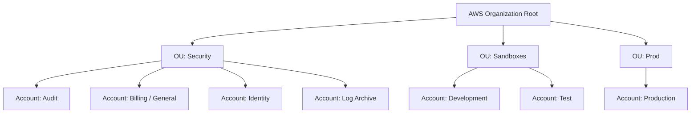

# AWS Organization Setup Guide

This guide provides step-by-step instructions to create an AWS Organization, set up Organizational Units (OUs), and provision new AWS accounts using the AWS Management Console.

---

## 🧰 Prerequisites

- Access to an email account with support for dynamic alias.
- A valid credit card.
- A virtual MFA device (1Password has been used in this setup)

---

## 🏗️ Step-by-Step Instructions

<strong>Step 1: Create an AWS Management (General) Account</strong>

 

| Step |
|:-----|
| **1. Sign up for a general AWS account**  |
| **2. Verify your email address**  |
| **3. Set up the root password**  |
| **4. Provide contact information**  |
| **5.Provide billing information**  |
| **6.Confirm identity**  |
| **7.Provide verification code**  |
| **8.Select a support plan**  |
| **9.Confirm account creation**  |
| **10.Login to the root account**  |
| **11.Set up contact details**  |
| **12.Grant billing info access to IAM user**  |
| **13.Add MFA to the root user (part 1)**  |
| **14.Add MFA to the root user (part 2)**  |
| **15.Create an account alias**  |
| **16. Bookmark the sign-in URL**  |
| **17. Sign in as root user (part 1)**  |
| **18. Sign in as root user (part 2)**  |
| **19. Sign in as root user (part 3)**  |
| **20. Sign in as root user (part 4)**  |
| **21. Confirm you are logged in as root user**  |
| **22. Create a spending budget ** |
| **23. Configure monthly cost budget (part 1)**  |
| **24. Configure monthly cost budget (part 2)**  |
| **25. Create an IAM user (part 1)**  |
| **26. Create an IAM user (part 2)**  |
| **27. Attach IAM policies**  |
| **28. Finalize IAM admin user creation**  |
| **29. Login as the new IAM admin user**  |
| **30. Add MFA to IAM admin user**  |

<strong>Step 2: Create an AWS Management (Development) Account</strong>

 

| Step |
|:-----|
| **1 . Sign up for a general AWS account**  |
| **2 . Create IAM Admin user and setup MFA** |

  

<strong>Step 3: Create an AWS Organization using Management account</strong>

 

| Step | Description                                                               . Screenshot |
|:-----|:-----------------------------------------------------------------------------|:-----------|
| **1. Log in to General AWS Account as IAM User (Administrator Access)**  |
| **2. Accept the disclairmer and create the organization.** |
| **3. An organization gets created with the management account as the root account**. |

<strong>Step 4: Invite Development account to join the organization</strong>

 

| Step |
|:-----|
| **1. Log in to General AWS Account as IAM User, go to `AWS Organization`**   |
| **2. Select the option to create a new account** |
| **3. Log into development account and view the invitation** |
| **4. Accept the invitation to join the organization** |
| **5. A conformation is displayed** |
| **6. The development account is shown as a member account in the organization** |

<strong>Step 5: Create Staging and Production accounts within the Organization</strong>

 

| Step |
|:-----|
| **1. Log in to General AWS Account as IAM User, go to `AWS Organization`**   |
| **2. Select the option to create a staging (test) AWS Account, fill in the details and create the account** |
| **3. A new account gets created and added to the organization** |
| **4. Repeat the step to create a production AWS account** |
| **5. The AWS organization is setup with management, development, staging and production accounts** |

<strong>Step 6: Create two three Organization Units and five AWS Accounts</strong>

 

| Step | 
|:-----|
| **1. Log in to General AWS Account as IAM User, go to `AWS Organization` select the root organization and create a new `Organizational Unit` named `Sandboxes`**   |
| **2. Similarly create another organization unit named `Prod`** |
| **3. Move the development and test accounts under `dev-test` org unit and production account under `Prod` org unit** |
| **4. Enable service control and tag policies** |
| **5. Service control and tag policies enableld** |

<strong>Step 7: Enhance the Organization Structure by following the best practices</strong>

 

<strong>Step 9: Setup Landing Zone using AWS Control Tower</strong>

<strong>Step 8: Configure Service Control Policy - Management Account</strong>

<strong>Step 9: Configure Service Control Policy - Identity Account</strong>

<strong>Step 8: Configure Tag Policy</strong>

